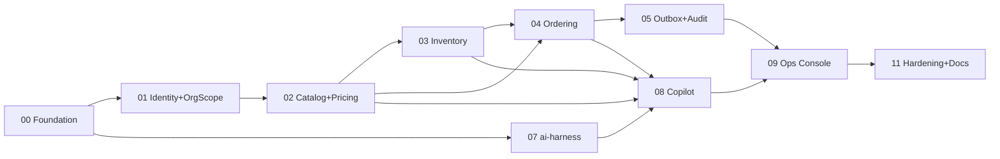

# StockFlow v2 — B2B e-commerce (NestJS + AI Harness)

Build lại StockFlow (Go/Gin) thành app B2B e-commerce TypeScript/NestJS, có frontend thật và ops copilot chạy trên AWS Bedrock.

**Brainstorm report:** [`../reports/from-brainstorm-to-planner-260916-2327-stockflow-v2-b2b-nestjs-ai-harness-report.md`](../reports/from-brainstorm-to-planner-260916-2327-stockflow-v2-b2b-nestjs-ai-harness-report.md)

> **Bản sửa 2026-09-17.** Plan đã qua red-team 4 reviewer đối kháng. 16 finding được chấp nhận và áp vào (xem [§Red Team Review](#red-team-review)), scope cắt theo Minimum Viable Plan. Ước lượng đã re-baseline theo đơn giá thật. Phase 06 và 10 **cancelled** — file giữ lại làm hồ sơ lý do.

## Mục tiêu

Học sâu kiến trúc + AI. Thước đo là *mỗi thứ build ra dạy được gì*, không phải số lượng feature. Phase xếp theo **5 chương kỹ thuật**.

| Chương | Bài học | Phase |
|---|---|---|
| 1. Concurrency & transaction | atomic conditional update, lock ordering, ledger append-only, ranh giới transaction tường minh | 03, 04 |
| 2. Pricing as policy engine | port + hàm chọn giá thuần, audit nguồn giá | 02 |
| 3. Outbox & eventual consistency | write cùng tx, relay `SKIP LOCKED`, consumer idempotent, crash recovery | 05 |
| 4. Multi-tenant boundary & RBAC | `OrgScope`, guard, không rò dữ liệu | 01 |
| 5. Agent over domain tools | agent không có quyền cao hơn user, human-in-the-loop, tool lifecycle events | 07, 08 |

## Nguồn tham chiếu (read-only)

| Repo | Dùng để |
|---|---|
| `D:\Project field\Personal project\StockFlow\StockFlow` | Tái dựng schema từ `module/*/storage/*.go` (repo **không có migration**); port domain + luồng nghiệp vụ |
| `D:\Project field\Personal project\AI Harness Clone\AI-Harness-Clone` | Port harness. **Đọc TypeScript thật, không đọc README** — red-team chứng minh tài liệu của repo đó mô tả khác code ở nhiều chỗ then chốt |

## Phases

| # | Phase | Status | Priority | Depends on | Ước lượng (8h/ngày) |
|---|---|---|---|---|---|
| 00 | [Foundation, Platform & Spike](phase-00-foundation-and-bedrock-spike.md) | in-progress (spike chờ AWS credential) | P1 | — | 4–5 ngày |
| 01 | [Identity, Auth, RBAC & OrgScope](phase-01-identity-auth-rbac.md) | **completed** | P1 | 00 | 4 ngày |
| 02 | [Catalog, Warehouse & Pricing](phase-02-catalog-warehouse-pricing.md) | **completed** | P1 | 01 | 3 ngày |
| 03 | [Inventory Core & Ledger](phase-03-inventory-core-ledger.md) | **completed** | P1 | 02 | 2 ngày |
| 04 | [Ordering, Atomic Reservation & Lifecycle](phase-04-ordering-atomic-reservation.md) | **completed** | P1 | 02, 03 | 5 ngày |
| 05 | [Outbox Relay, Scheduler & Audit](phase-05-outbox-relay-scheduler.md) | **completed** | P1 | 04 | 3 ngày |
| 06 | ~~Payment (Simulated)~~ | **cancelled** | — | — | — |
| 07 | [packages/ai-harness Extraction](phase-07-ai-harness-package.md) | **completed** (smoke test chờ AWS credential) | P1 | 00 | 6 ngày |
| 08 | [Ops Copilot](phase-08-ops-copilot.md) | **completed** | P1 | 02, 03, 04, 07 | 4 ngày |
| 09 | [Web Foundation & Ops Console](phase-09-web-ops-console.md) | **completed** (e2e copilot gate sau `E2E_COPILOT=1`) | P1 | 05, 08 | 5 ngày |
| 10 | ~~Buyer Portal~~ | **cancelled** | — | — | — |
| 11 | [Hardening, Docs & Diagrams](phase-11-docs-diagrams-hardening.md) | **completed** (quickstart còn một nhánh chưa kiểm) | P2 | 09 | 3 ngày |

**Tổng ≈ 39 ngày làm việc ≈ 8 tuần.**

### Về con số này — đọc kỹ

Bản đầu ước 35–37 ngày. Red-team chứng minh đơn giá đó là ảo tưởng (plan đầy đủ thực chất 45–50 ngày). Cắt theo MVP **và** dùng đơn giá thật **và** cộng công sửa 16 finding ⇒ 39 ngày. Cắt scope mua được ~8 ngày, không phải ~20 như con số MVP thô gợi ý — vì con số đó tính theo đơn giá cũ.

### Vì sao cắt Phase 06 và 10

| Phase | Lý do cắt | Thay bằng |
|---|---|---|
| 06 Payment | Không thuộc chương nào trong 5 chương. Ba bài học nó tuyên bố dạy: idempotency (đã có ở 04), state machine (đã có ở 04), port/adapter (đã có ở 02 và 07) | `POST /orders/:id/mark-paid` ops-only trong Phase 04 — thứ Phase 04 vốn đã cần vì test #4/#11 của nó đòi đơn `paid` |
| 10 Buyer portal | Không thuộc chương nào. Hai thứ nó trưng bày (giá hợp đồng, reservation) đã nhìn thấy được trong ops console. Chính plan đầu đã đề cử nó là ứng viên cắt đầu tiên | — (v1.1) |



Phase 07 chỉ phụ thuộc 00 ⇒ chạy xen kẽ được. **Nhưng** migration đánh số cứng theo tên file, nên nếu đảo vị trí phải đổi sang migration prefix timestamp — xem Phase 00 §Migration.

## Bốn quyết định thiết kế xuyên phase (chốt sau red-team)

### D1 — `OrgScope` thay cho `orgId` trần

Ops user thuộc org `internal`; dữ liệu thương mại khoá theo `buyer_org_id`. Scope theo `actor.orgId` trần ⇒ ops thấy **rỗng**. Nên:

```ts
export type OrgScope =
  | { kind: 'single';  orgId: string }        // buyer: chỉ org mình
  | { kind: 'all-buyers' }                    // internal + ops: mọi buyer org
export function orgScopeOf(actor: Actor): OrgScope
```
Mọi application service nhận `OrgScope` (không nhận org id rời). Repository dịch sang `WHERE`. Tool nào cần chỉ định khách cụ thể (`get_contract_price`) nhận `customerOrgId` **và** kiểm `customerOrgId ∈ scope` — không phải tin vào LLM.

### D2 — Không có trạng thái `releasing`

Sweeper claim **đơn hàng** bằng `FOR UPDATE SKIP LOCKED` **trong chính transaction làm việc expire**. Row lock *là* claim ⇒ không cần trạng thái trung gian ⇒ không có ngõ cụt. `inventory_reservations.status` chỉ còn `held | released | consumed`.

### D3 — Transaction tường minh

Mọi use case nhận `tx: Tx` làm tham số. Controller bọc `withTransaction`, scheduler bọc của nó. Không propagation ngầm, không AsyncLocalStorage. Ranh giới transaction nằm trong chữ ký hàm.

Isolation: **READ COMMITTED** đặt tường minh, `lock_timeout=5s`, `statement_timeout=15s` per-connection. Conditional UPDATE an toàn ở mức này; không cần retry `40001`. Có test assert `transaction_isolation`.

### D4 — Pricing: giữ port, bỏ chain

`PriceResolver` port ở lại (seam thật). Một implementation: 1 query lấy candidate từ price list + 1 query fallback `base_price` + hàm thuần `pickPrice()` làm bậc số lượng và tie-break. Bỏ `ChainPriceResolver` + 3 class resolver.

## Chế độ TDD

`--tdd`. Test stack: **Vitest + testcontainers (Postgres thật)**, `vitest.config.ts` cấu hình isolation tường minh (xem Phase 00).

| Phase | TDD | Lý do |
|---|---|---|
| 01–08 | **Nghiêm** | Có invariant kiểm chứng được |
| 00 | Một phần | Phase dựng chính test harness |
| 09 | Lỏng | UI — component test + 2 e2e happy path |
| 11 | Không | Hardening + docs |

## Acceptance criteria

1. **Không oversell** — 50 request song song mua 1 SKU còn 10 ⇒ **đúng 10 HTTP 2xx và đúng 40 HTTP 409 `INSUFFICIENT_STOCK`** (đếm theo status code, không chỉ theo bất biến tổng), không có `available_qty` âm, tổng ledger khớp. Lặp 10 lần không flaky. *(Phase 04)*
2. **Giá do server quyết** — client gửi `unit_price` tuỳ ý bị bỏ qua; `order_items.unit_price` khớp `PriceResolver`; `price_list_item_id` truy vết được nguồn. *(Phase 02, 04)*
3. **Release đúng & idempotent** — cancel/expire trả lại **đúng và đủ** lượng đã giữ kể cả đơn nhiều dòng bị chia batch; gọi 2 lần vẫn đúng; reservation quá hạn được scheduler tự release. *(Phase 04, 05)*
4. **Tenant isolation** — buyer org A không đọc được order/giá/**copilot session**/memory của org B qua bất kỳ endpoint nào. Ops đọc được mọi buyer org **qua `OrgScope`, không qua bypass**. *(Phase 01, 08)*
5. **Copilot không vượt quyền** — mọi tool qua application service có guard; `modules/copilot` không có SQL; tool ghi duy nhất chỉ tạo đề xuất; **approve có `@Roles('ops_admin')` và cấm tự duyệt đề xuất của chính mình**. *(Phase 08)*
6. **Outbox** — state change + event cùng transaction; **một** nguồn sự thật cho "đã xử lý"; relay at-least-once; crash sau claim vẫn được thử lại; consumer idempotent. *(Phase 05)*
7. **Tiền** — không có kiểu float biểu diễn tiền ở bất kỳ tầng nào, gồm cả `apps/web` và `packages/contracts`. *(Phase 02+)*
8. **Dựng lại từ 0** — `docker compose up` trên máy sạch ⇒ DB có schema + seed, API healthy, web mở được. *(Phase 00, 11)*
9. **Tool lifecycle observable** — `AgentRuntime.stream()` phát `tool_start`/`tool_end` từ một tool call thật qua Bedrock. *(Phase 00 spike, Phase 07)*

## Ràng buộc bất di bất dịch

- TypeScript + NestJS 11; handwritten SQL (`pg`), **không ORM**.
- Layout module map 1:1 StockFlow cũ: `domain/` ← `model/`, `application/` ← `biz/`, `infrastructure/` ← `storage/`, `http/` ← `transport/gin/`.
- `packages/ai-harness` **không bao giờ** import `apps/api`.
- `modules/copilot` **không bao giờ** chạm repository/SQL.
- `platform/` **không bao giờ** import `modules/` — và mọi thứ biết về domain (scheduler job, outbox dispatcher routing) **nằm trong `modules/`**, không nằm trong `platform/`.
- **Không text-to-SQL**, trong mọi hoàn cảnh.
- Tiền: `numeric(18,2)` ở DB, integer minor-units trong app.
- Một currency cho toàn hệ thống v1 (`VND`), validate ở biên. Multi-currency là v1.1 — nửa vời là lựa chọn tệ nhất.
- Markdown chỉ nằm trong `plans/` và `docs/`.

## Out of scope v1

| Hạng mục | Trạng thái |
|---|---|
| Deploy AWS + CI/CD | Out (user chốt). Kiến trúc vẫn 12-factor, stateless |
| Buyer copilot | Out (user chốt). `AGENT_REGISTRY` để sẵn chỗ |
| **Payment module** | **Cắt sau red-team** — thay bằng `mark-paid` ops-only ở Phase 04 |
| **Buyer portal** | **Cắt sau red-team** — v1.1 |
| Quote/RFQ + duyệt đơn | v1.1 — schema chừa chỗ |
| Công nợ / Net-30 | v1.1 — `organizations.credit_limit` chừa chỗ |
| Multi-currency | v1.1 — v1 khoá một currency |
| Postgres RLS | v2 — ADR ghi lý do hoãn ở Phase 01 |
| Marketplace nhiều seller | v2 — `organizations.type` chừa chỗ |

## Rủi ro

| # | Rủi ro | Giảm thiểu | Phase |
|---|---|---|---|
| 1 | **Strands SDK không phát tool lifecycle event.** Bản gốc `streamAgent` chỉ yield `textDelta`; event union được chính code gọi là "opaque". Chương 5 và trục demo của Phase 09 phụ thuộc vào nó | **Spike ở Phase 00**: chứng minh một tool call thật phát event quan sát được. Nếu không ⇒ viết `OpenAiToolLoopRuntime` (ước 2–3 ngày, **đã tính vào 6 ngày của Phase 07**), không phải "bảo hiểm miễn phí" | 00, 07 |
| 2 | **Bedrock region / model access.** Fail thì chặn 07→08→09→11 = **18 trên 39 ngày**, không phải "chỉ 07–08" | Spike ngay bước 1 Phase 00. Có phương án LiteLLM trỏ provider khác để 01–05 không bị chặn | 00 |
| 3 | Phase 07 khó hơn plan đầu thừa nhận — orchestration nằm trong `SessionController` 231 dòng mà package không ship | Đã re-baseline 3→6 ngày; `ChatTurnService` là deliverable tường minh | 07 |
| 4 | Tái dựng schema từ SQL repo cũ | Red-team đã verify 20/23 claim, gồm cả `inventory_transactions` 15 cột. Rủi ro đã hạ | 00–04 |
| 5 | Copilot chạm thẳng DB | ESLint `no-restricted-imports` + test quét mã + rule trong code-standards | 00, 08 |
| 6 | Chi phí Bedrock trôi | LiteLLM virtual key budget; cache embedding có `input_type` trong khoá; rate limit theo `actor.userId` | 00, 07, 08 |
| 7 | **Test concurrency flaky** ⇒ bất biến quan trọng nhất mất niềm tin | `vitest.config.ts` đặt `fileParallelism` tường minh; assert theo **status code** chứ không chỉ bất biến tổng (một lần chạy toàn 500 phải FAIL); pool ≥60 đối chiếu `max_connections` | 00, 04 |
| 8 | Monorepo tooling (ESM/CJS, decorator metadata, zod version) chưa quyết ⇒ ma sát cao nhất của monorepo | Quyết ở Phase 00 + ADR: source consumption qua tsconfig paths + Vite alias, zod pin ở root, peer deps | 00 |

## Quyết định đã chốt (không còn câu hỏi treo)

| Câu hỏi | Chốt | Lý do |
|---|---|---|
| Region AWS | **`us-east-1`** | Rộng model Bedrock nhất (Claude Haiku 4.5 + Cohere Embed v3). Vẫn xác minh ở spike Phase 00; fail thì đổi và ghi vào ADR 0003 |
| `reservation_expires_at` mặc định | **30 phút**, cấu hình được | B2B không mua bốc đồng: 15 phút quá gấp cho luồng duyệt v1.1; 24h khoá kho quá lâu và nới cửa sổ khoá kho mà red-team chỉ ra. 30 phút là điểm giữa biện minh được |
| JWT mang org nào nếu ≥2 membership | **Login nhận `orgCode` tuỳ chọn**: 1 membership ⇒ suy ra; ≥2 mà không truyền ⇒ 400 kèm danh sách org | Giữ `org_members` (đường mở cho nhà phân phối mua hộ nhiều khách) mà không để `Actor.orgId` là hành vi không xác định |
| Quy mô seed | **20 SKU · 2 warehouse · 1 internal + 2 buyer org · 2 bảng giá hợp đồng chênh rõ** | Đủ để copilot có cái so sánh; chốt ở Phase 02 |
| Multi-currency | **Ngoài v1**, khoá `VND` bằng `CHECK` ở DB | Nửa vời là lựa chọn tệ nhất — nới là một migration |

*(Đã đóng trước đó: quote/RFQ + payment gateway → cắt khỏi v1.)*

---

## Red Team Review

### Session — 2026-09-17

**Reviewers:** 4 (Security Adversary · Failure Mode Analyst · Assumption Destroyer · Scope & Complexity Critic), Full verification tier.
**Findings:** 39 thô → **16 sau khi gộp** (16 accepted, 0 rejected). Evidence filter: 0 bị loại — mọi finding có `file:line`.
**Severity:** 12 Critical, 4 High.

**Kết luận xuyên suốt:** mọi phần plan dựa trên **đọc code** repo Go đứng vững (20/23 claim VERIFIED, gồm tái dựng schema từng cột). Mọi phần dựa trên **đọc tài liệu** AI-Harness đều gãy khi đối chiếu TypeScript thật.

| # | Finding | Sev | R | Disposition | Applied to |
|---|---------|-----|---|-------------|------------|
| 1 | Expire giải phóng 0 tồn kho — `releasing` là ngõ cụt; batch chia đơn; guard idempotent khoá phần còn lại | Critical | 3 | Accept | 04, 05 (D2) |
| 2 | Org `internal` không có đường đọc — ops scope theo `actor.orgId` trả rỗng; AC#4 cấm ops console tồn tại | Critical | 2 | Accept | 01, 04, 08 (D1) |
| 3 | Copilot session không có chủ — `chat_sessions` 4 cột, IDOR đọc transcript org khác | Critical | 2 | Accept | 07, 08 |
| 4 | `tool_start`/`tool_end` không tồn tại — `streamAgent` chỉ yield `textDelta` | Critical | 2 | Accept | 00, 07, 08, 09 |
| 5 | Transaction lồng nhau — sweeper mở tx rồi gọi use case tự mở tx; `UnitOfWork` không có join | Critical | 1 | Accept | 00, 05 (D3) |
| 6 | Isolation level / `lock_timeout` / retry chưa bao giờ được nêu | Critical | 1 | Accept | 00, 04 (D3) |
| 7 | Callback thanh toán không xác thực; `__simulate` gate `NODE_ENV` vô hiệu theo thiết kế | Critical | 1 | Accept | 06 cancelled → rủi ro biến mất |
| 8 | Approve proposal không `@Roles`, không cấm tự duyệt, không ràng buộc role↔org type | Critical | 1 | Accept | 01, 08 |
| 9 | Khối `MemoryStore` ở P07 là bịa; "namespace bắt buộc" là tiền đề sai | Critical | 2 | Accept | 07 |
| 10 | P07 bỏ lại orchestration trong `SessionController`; Invariant 2 không có nhà; `forRoot` không có slot DB | Critical | 1 | Accept | 07 |
| 11 | `ToolDefinition` boot-time vs `ToolFactory` per-request; 5 type harness chưa đặc tả | Critical | 1 | Accept | 07, 08 |
| 12 | Lint rule P00 làm P05 không compile (scheduler + dispatcher trong `platform/`) | Critical | 1 | Accept | 00, 05 |
| 13 | Contract drift 7 chỗ (`PriceResolver` ×3, `OrderService.list`, `getStatus`, `release/consumeAtomic`, `markPaid`) | High | 2 | Accept | 02, 03, 04, 08 (D4) |
| 14 | Outbox hai nguồn sự thật; `audit_log` xuyên tenant, `org_id` nullable, payload chứa giá | High | 3 | Accept | 04, 05 |
| 15 | Test design biến AC#1 thành test ma (vitest parallelism; bất biến tổng pass khi toàn 500) | High | 2 | Accept | 00, 04 |
| 16 | Idempotency claim nằm trong tx của đơn — rollback xoá key; cột `status` không ai đọc | High | 2 | Accept | 04 |

**Nhóm phụ đã gộp vào các finding trên:** Redis limiter "đã port ở Phase 00" (sai — P00 không tạo) → #12/00; SSE auth + CSRF refresh cookie (0 hit toàn plan) → #3/01/09; `embedding_cache` thiếu `input_type` trong PK → #9/07; `verify-architecture.sh` grep đường dẫn không tồn tại nên pass rỗng → #15/11; monorepo tooling chưa quyết → rủi ro #8; YAGNI (`org_members`, `Money` multi-currency nửa vời, 4 tầng cho `warehouse`/`audit`) → MVP cut + ràng buộc một currency.

**Chưa tự verify được:** claim về `input_type` asymmetry của embedding (grep trả "Binary file matches"). Áp fix vì chi phí thấp và hậu quả nếu đúng thì rất khó debug, nhưng đánh dấu là **chưa xác nhận trực tiếp**.

**Báo cáo đầy đủ:** `reports/from-code-reviewer-to-planner-red-team-{security-adversary,failure-mode-analyst,assumption-destroyer,scope-complexity-critic}-plan-review-report.md`

### Whole-Plan Consistency Sweep

- **Files reread:** `plan.md` + cả 12 `phase-*.md`.
- **Decision deltas checked:** 9 — bỏ trạng thái `releasing`; `orgId` trần → `OrgScope`; transaction tường minh `tx: Tx`; bỏ `ChainPriceResolver`; `markPaid` chuyển từ Phase 06 sang 04; cắt Phase 06 và 10; outbox một nguồn sự thật; job/dispatcher chuyển từ `platform/` sang `modules/`; `MemoryStore` dùng chữ ký thật.
- **Reconciled stale references:** 1 — migration nhảy `007 → 009` do Phase 06 (cancelled) từng giữ `008`. Đánh số lại `009_ai_memory → 008`, `010_copilot → 009`; giờ liền mạch 001–009. Gap vô hại về chức năng nhưng là đúng cái bẫy "thứ tự applied lệch thứ tự tên" mà Phase 00 cảnh báo.
- **Cập nhật 2026-09-19:** `008` giờ là `008_list_query_indexes.sql` (hardening Phase 11 làm trước 07/08). Migration AI lùi thành `009_ai_memory` và `010_copilot` — đã sửa trong phase-07/08.
- **Unresolved contradictions: 0.**

Đã quét và xác nhận sạch: không file nào còn coi `releasing` là trạng thái sống (hit duy nhất là dòng verify script *kiểm tra sự vắng mặt* của nó); `ChainPriceResolver` biến mất hoàn toàn; `/ops/dashboard` chỉ còn trong ghi chú nói nó đã bị bỏ; tham chiếu Phase 06/10 chỉ nằm trong chính hai file cancelled để ghi lại lý do; ADR 0001–0025 liên tục, không trùng không sót; dependency graph khớp bảng phases; tổng ước lượng 39–40 ngày khớp con số công bố.
